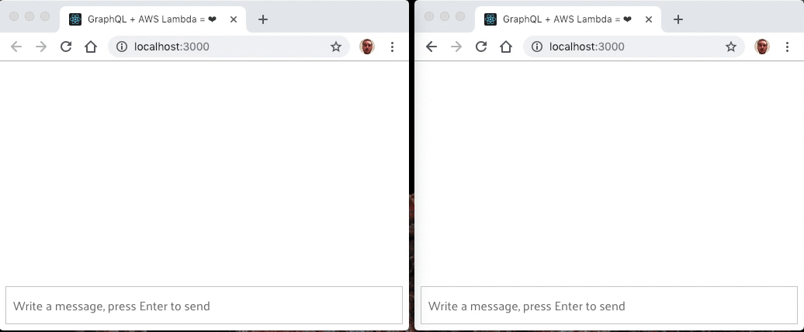

# Apollo AWS Lambda with GraphQL subscriptions

<!-- prettier-ignore-start -->
<!-- markdownlint-disable -->
[](https://circleci.com/gh/michalkvasnicak/aws-lambda-graphql)
[](https://www.npmjs.com/package/aws-lambda-graphql)<!-- ALL-CONTRIBUTORS-BADGE:START - Do not remove or modify this section -->
[](#contributors-)
<!-- ALL-CONTRIBUTORS-BADGE:END -->
<!-- markdownlint-enable -->
<!-- prettier-ignore-end -->

**⚠️ This documentation is currently for 1.0.0-alpha.X package which supports only [subscriptions-transport-ws](https://github.com/apollographql/subscriptions-transport-ws) and drops the legacy protocol and client support! To use old version that supports legacy protocol and client see the link 0.13.0 below.**

[**📖Documentation for `aws-lambda-graphql0.13.0`**](https://github.com/michalkvasnicak/aws-lambda-graphql/tree/aws-lambda-graphql%400.13.0)

Use [Apollo Server Lambda](https://github.com/apollographql/apollo-server/tree/master/packages/apollo-server-lambda) with GraphQL subscriptions over WebSocket (AWS API Gateway v2).

With this library you can do:

- same things as with [apollo-server-lambda](https://github.com/apollographql/apollo-server/tree/master/packages/apollo-server-lambda) by utiizing AWS API Gateway v1
- GraphQL subscriptions over WebSocket by utilizing AWS API Gateway v2 and [subscriptions-transport-ws](https://github.com/apollographql/subscriptions-transport-ws)



## Table of contents

- [Quick start](#quick-start)
  - [1. Create a server](#1-create-a-server)
    - [1.1 Setting up Connection and Subscription management](#11-setting-up-connection-and-subscription-management)
    - [1.2 Setting up an Event store](#12-setting-up-an-event-store)
    - [1.3 Setting up the GraphQL schema](#13-setting-up-the-graphql-schema)
    - [1.4 Create a PubSub instance](#14-create-a-pubsub-instance)
    - [1.5 Create WebSocket/HTTP event handlers and event processor handler](#15-create-websockethttp-event-handlers-and-event-processor-handler)
    - [1.6 Pass PubSub to resolvers using GraphQL context](#16-pass-pubsub-to-resolvers-using-graphql-context)
  - [2 Connect to the server using Apollo Client and `subscriptions-transport-ts`](#2-connect-to-the-server-using-apollo-client-and-subscriptions-transport-ts)
  - [3 Deploy and development](#3-deploy-and-development)
    - [3.1 Serverless support](#31-serverless-support)
    - [3.2 Serverless-offline support](#32-serverless-offline-support)
- [Packages](#packages)
  - [aws-lambda-graphql package](./packages/aws-lambda-graphql)
    - [Installation](./packages/aws-lambda-graphql#installation)
    - [Usage](./packages/aws-lambda-graphql#usage)
    - [API](./packages/aws-lambda-graphql#api)
    - [Examples](./packages/aws-lambda-graphql#examples)
- [Infrastructure](#Infrastructure)
- [Examples](#examples)

## Quick start

In this quick example we're going to build a simple broadcasting server that broadcasts messages received using `broadcastMessage` mutation to all subscribed connections.

[Skip to final implementation](#15-create-websockethttp-event-handlers-and-event-processor-handler) if you don't need a step by step guide

### 1. Create a server

First we need to install dependencies:

```console
yarn add aws-lambda-graphql graphql graphql-subscriptions aws-sdk
# or
npm install aws-lambda-graphql graphql graphql-subscriptions aws-sdk
```

**Note that `aws-sdk` is required only for local development, it's provided by the AWS Lambda by default when you deploy the app**

Now we have all the dependencies installed so lets start with server implementation.

#### 1.1 Setting up Connection and Subscription management

Our GraphQL server needs to know how to store connections and subscriptions because Lambdas are stateless. In order to do that we need create instances of the [Connection manager](./packages/aws-lambda-graphql/src/types/connections.ts) and [Subscription manager](./packages/aws-lambda-graphql/src/types/subscriptions.ts). We have two options of persistent storage for our connections and subscriptions.

DynamoDB:

```js
import {
  DynamoDBConnectionManager,
  DynamoDBSubscriptionManager,
} from 'aws-lambda-graphql';

/*
 By default subscriptions and connections use TTL of 2 hours. 
 This can be changed by `ttl` option in DynamoDBSubscriptionManager and DynamoDBConnectionManager.

 ttl accepts a number in seconds (default is 7200 seconds) or
 false to turn it off.

 It's your responsibility to set up TTL on your connections and subscriptions tables.
*/
const subscriptionManager = new DynamoDBSubscriptionManager();
const connectionManager = new DynamoDBConnectionManager({
  subscriptionManager,
});
```

**⚠️ in order to clean up stale connections and subscriptions please set up TTL on `ttl` field in Connections, Subscriptions and SubscriptionOperations tables. You can turn off the TTL by setting up `ttl` option to `false` in `DynamoDBSubscriptionManager` and `DynamoDBConnectionManager`.**

Redis:

```js
import {
  RedisConnectionManager,
  RedisSubscriptionManager,
} from 'aws-lambda-graphql';
import Redis from 'ioredis';

const redisClient = new Redis({
  port: 6379, // Redis port
  host: '127.0.0.1', // Redis host
});

const subscriptionManager = new RedisSubscriptionManager({
  redisClient,
});
const connectionManager = new RedisConnectionManager({
  subscriptionManager,
  redisClient,
});
```

#### 1.2 Setting up an Event store

In order to be able to broadcast messages (publish events) we need an [Event store](./packages/aws-lambda-graphql/src/types/events.ts). Because our server can received a lot of messages we need to work with events in async, meaning that the actual events are not published directly from mutation but rather they are stored in underlying data store which works as an event source for our server. Because we decided to use DynamoDB as our persistent store, we are goint to use it as our event source.

```js
import {
  DynamoDBConnectionManager,
  DynamoDBEventStore,
  DynamoDBSubscriptionManager,
} from 'aws-lambda-graphql';

/*
 By default event stores uses TTL of 2 hours on every event. 
 This can be changed by `ttl` option in DynamoDBEventStore.
 ttl accepts a number in seconds (default is 7200 seconds) or
 false to turn it off.

 It's your responsibility to set up TTL on your events table.
*/
const eventStore = new DynamoDBEventStore();
const subscriptionManager = new DynamoDBSubscriptionManager();
const connectionManager = new DynamoDBConnectionManager({
  subscriptionManager,
});
```

That's it for now. Our `eventStore` will use DynamoDB to store messages that we want to broadcast to all subscribed clients.

**⚠️ in order to clean up old events, please set up TTL on `ttl` field in Events store table. This can be turned off by setting up the `ttl` option to `false`.**

#### 1.3 Setting up the GraphQL schema

Our server needs a GraphQL schema. So we'll create one.

```js
import {
  DynamoDBConnectionManager,
  DynamoDBEventStore,
  DynamoDBSubscriptionManager,
} from 'aws-lambda-graphql';

const eventStore = new DynamoDBEventStore();
const subscriptionManager = new DynamoDBSubscriptionManager();
const connectionManager = new DynamoDBConnectionManager({
  subscriptionManager,
});

const typeDefs = /* GraphQL */ `
  type Mutation {
    broadcastMessage(message: String!): String!
  }

  type Query {
    """
    Dummy query so out server won't fail during instantiation
    """
    dummy: String!
  }

  type Subscription {
    messageBroadcast: String!
  }
`;
```

From given schema we already see that we need to somehow publish and process broadcasted message. For that purpose we must create a [PubSub](./packages/aws-lambda-graphql/src/types/events.ts) instance that uses our DynamoDB event store as underlying storage for events.

#### 1.4 Create a PubSub instance

PubSub is responsible for publishing events and subscribing to events. Anyone can broadcast message using `broadcastMessage` mutation (publish) and anyone connected over WebSocket can subscribed to `messageBroadcast` subscription (subscribing) to receive broadcasted messages.

**⚠️ Be careful! By default `PubSub` serializes event payload to JSON. If you don't want this behaviour, set `serializeEventPayload` option to `false` on your `PubSub` instance.**

```js
import {
  DynamoDBConnectionManager,
  DynamoDBEventStore,
  DynamoDBSubscriptionManager,
  PubSub,
} from 'aws-lambda-graphql';

const eventStore = new DynamoDBEventStore();
const subscriptionManager = new DynamoDBSubscriptionManager();
const connectionManager = new DynamoDBConnectionManager({
  subscriptionManager,
});
const pubSub = new PubSub({
  eventStore,
  // optional, if you don't want to store messages to your store as JSON
  // serializeEventPayload: false,
});

const typeDefs = /* GraphQL */ `
  type Mutation {
      broadcastMessage(message: String!): String!
    }

    type Query {
      """
      Dummy query so out server won't fail during instantiation
      """
      dummy: String!
    }

    type Subscription {
      messageBroadcast: String!
    }
`;

const resolvers: {
  Mutation: {
    broadcastMessage: async (
      root,
      { message },
    ) => {
      await pubSub.publish('NEW_MESSAGE', { message });

      return message;
    },
  },
  Query: {
    dummy: () => 'dummy',
  },
  Subscription: {
    messageBroadcast: {
      // rootValue is same as the event published above ({ message: string })
      // but our subscription should return just a string, so we're going to use resolve
      // to extract message from an event
      resolve: rootValue => rootValue.message,
      subscribe: pubSub.subscribe('NEW_MESSAGE'),
    },
  },
};
```

Our GraphQL schema is now finished. Now we can instantiate the server so we can actually process HTTP and WebSocket events received by our Lambda server and send messages to subscribed clients.

#### 1.5 Create WebSocket/HTTP event handlers and event processor handler

In order to send messages to subscribed clients we need the last piece and it is a [Event processor](./packages/aws-lambda-graphql/src/types/events.ts). Event processor is responsible for processing events published to our Event store and sending them to all connections that are subscribed for given event.

Because we use DynamoDB as an event store, we are going to use [DynamoDBEventProcessor](./packages/aws-lambda-graphql/src/DynamoDBEventProcessor.ts).

```js
import {
  DynamoDBConnectionManager,
  DynamoDBEventProcessor,
  DynamoDBEventStore,
  DynamoDBSubscriptionManager,
  PubSub,
  Server,
} from 'aws-lambda-graphql';

const eventStore = new DynamoDBEventStore();
const eventProcessor = new DynamoDBEventProcessor();
const subscriptionManager = new DynamoDBSubscriptionManager();
const connectionManager = new DynamoDBConnectionManager({
  subscriptionManager,
});
const pubSub = new PubSub({ eventStore });

const typeDefs = /* GraphQL */ `
  type Mutation {
      broadcastMessage(message: String!): String!
    }

    type Query {
      """
      Dummy query so out server won't fail during instantiation
      """
      dummy: String!
    }

    type Subscription {
      messageBroadcast: String!
    }
`;

const resolvers: {
  Mutation: {
    broadcastMessage: async (
      root,
      { message },
    ) => {
      await pubSub.publish('NEW_MESSAGE', { message });

      return message;
    },
  },
  Query: {
    dummy: () => 'dummy',
  },
  Subscription: {
    messageBroadcast: {
      // rootValue is same as the event published above ({ message: string })
      // but our subscription should return just a string, so we're going to use resolve
      // to extract message from an event
      resolve: rootValue => rootValue.message,
      subscribe: pubSub.subscribe('NEW_MESSAGE'),
    },
  },
};

const server = new Server({
  // accepts all the apollo-server-lambda options and adds few extra options
  // provided by this package
  connectionManager,
  eventProcessor,
  resolvers,
  subscriptionManager,
  typeDefs,
});

export const handleWebSocket = server.createWebSocketHandler();
export const handleHTTP = server.createHttpHandler();
// this creates dynamodb event handler so we can send messages to subscribed clients
export const handleEvents = server.createEventHandler();
```

Now our server is finished.

You need to map:

- ApiGateway v2 events to `handleWebSocket` handler
- ApiGateway v1 events to `handleHTTP`
- DynamoDB stream from events table to `handleEvents`.

In order to do that you can use [Serverless framework](https://serverless.com), see [`serverless.yml` file](./docs/serverless.yml).

To connect to this server you can use [`Apollo Client + subscriptions-transport-ts`](https://github.com/apollographql/subscriptions-transport-ws) - see example in section 2

#### 1.6 Pass PubSub to resolvers using GraphQL context

Sometime if you have complex schema you want to pass dependencies using context so it's easier to manage.

```js
import {
  DynamoDBConnectionManager,
  DynamoDBEventProcessor,
  DynamoDBEventStore,
  DynamoDBSubscriptionManager,
  PubSub,
  Server,
} from 'aws-lambda-graphql';

const eventStore = new DynamoDBEventStore();
const eventProcessor = new DynamoDBEventProcessor();
const subscriptionManager = new DynamoDBSubscriptionManager();
const connectionManager = new DynamoDBConnectionManager({
  subscriptionManager,
});
const pubSub = new PubSub({ eventStore });

const typeDefs = /* GraphQL */ `
  type Mutation {
      broadcastMessage(message: String!): String!
    }

    type Query {
      """
      Dummy query so out server won't fail during instantiation
      """
      dummy: String!
    }

    type Subscription {
      messageBroadcast: String!
    }
`;

const resolvers: {
  Mutation: {
    broadcastMessage: async (
      root,
      { message },
      ctx,
    ) => {
      await ctx.pubSub.publish('NEW_MESSAGE', { message });

      return message;
    },
  },
  Query: {
    dummy: () => 'dummy',
  },
  Subscription: {
    messageBroadcast: {
      resolve: rootValue => rootValue.message,
      // subscribe works similarly as resolve in any other GraphQL type
      // pubSub.subscribe() returns a resolver so we need to pass it all the args as were received
      // so we can be sure that everything works correctly internally
      subscribe: (rootValue, args, ctx, info) => {
        return ctx.pubSub.subscribe('NEW_MESSAGE')(rootValue, args, ctx, info);
      },
    },
  },
};

const server = new Server({
  // accepts all the apollo-server-lambda options and adds few extra options
  // provided by this package
  context: {
    pubSub,
  },
  connectionManager,
  eventProcessor,
  resolvers,
  subscriptionManager,
  typeDefs,
});

export const handleWebSocket = server.createWebSocketHandler();
export const handleHTTP = server.createHttpHandler();
// this creates dynamodb event handler so we can send messages to subscribed clients
export const handleEvents = server.createEventHandler();
```

### 2 Connect to the server using Apollo Client and `subscriptions-transport-ts`

First install dependencies

```console
yarn add apollo-link-ws apollo-cache-inmemory apollo-client subscriptions-transport-ws
# or
npm install apollo-link-ws apollo-cache-inmemory apollo-client subscriptions-transport-ws
```

```js
import { WebSocketLink } from 'apollo-link-ws';
import { InMemoryCache } from 'apollo-cache-inmemory';
import { ApolloClient } from 'apollo-client';
import { SubscriptionClient } from 'subscriptions-transport-ws';

const wsClient = new SubscriptionClient(
  'ws://localhost:8000', // please provide the uri of the api gateway v2 endpoint
  { lazy: true, reconnect: true },
  null,
  [],
);
const link = new WebSocketLink(wsClient);
const client = new ApolloClient({
  cache: new InMemoryCache(),
  link,
});
```

### 3 Deploy and development

#### 3.1 Serverless support

To deploy your api created using this library please see [`serverless.yml`](./packages/chat-example-server/serverless.yml) template of example app.

#### 3.2 Serverless-offline support

This library supports [serverless-offline](https://github.com/dherault/serverless-offline). But you have to do small changes in your code to actually support it, it's not automatical.

You need to set up custom endpoint for ApiGatewayManagementApi and custom endpoint for DynamoDB if you're using it. Please refer to [`chat-example-server`](./packages/chat-example-server) source code.

## Packages

### aws-lambda-graphql package

GraphQL client and server implementation for AWS Lambda.

See [package](./packages/aws-lambda-graphql)

## Infrastructure

Current infrastructure is implemented using [AWS Lambda](https://aws.amazon.com/lambda/) + AWS API Gateway v2 + [AWS DynamoDB](https://aws.amazon.com/dynamodb/) (with [DynamoDB streams](https://docs.aws.amazon.com/amazondynamodb/latest/developerguide/Streams.html)). But it can be implemented using various solutions (Kinesis, etc) because it's written to be modular.


## Examples

- [Chat App](./packages/chat-example-app) - React app
- [Chat Server](./packages/chat-example-server)
  - contains AWS Lambda that handles HTTP, WebSocket and DynamoDB streams
  - also includes `serverless.yml` file for easy deployment

## Contributing

- This project uses TypeScript for static typing.
- This projects uses conventional commits.
- This project uses Yarn and Yarn workspaces so only `yarn.lock` is commited.
- Please add a Changelog entry under `Unreleased` section in your PR.

### Testing

```console
yarn test
# running tests in watch mode
yarn test:watch
```

### Typecheck

```console
yarn build
```

Running tests locally:

```console
yarn test
```

## Contributors

Thanks goes to these wonderful people ([emoji key](https://allcontributors.org/docs/en/emoji-key)):

<!-- ALL-CONTRIBUTORS-LIST:START - Do not remove or modify this section -->
<!-- prettier-ignore-start -->
<!-- markdownlint-disable -->
<table>
  <tr>
    <td align="center"><a href="https://github.com/michalkvasnicak"><br /><sub><b>Michal Kvasničák</b></sub></a><br /><a href="#question-michalkvasnicak" title="Answering Questions">💬</a> <a href="https://github.com/michalkvasnicak/aws-lambda-graphql/commits?author=michalkvasnicak" title="Code">💻</a> <a href="#design-michalkvasnicak" title="Design">🎨</a> <a href="https://github.com/michalkvasnicak/aws-lambda-graphql/commits?author=michalkvasnicak" title="Documentation">📖</a> <a href="#example-michalkvasnicak" title="Examples">💡</a> <a href="#ideas-michalkvasnicak" title="Ideas, Planning, & Feedback">🤔</a> <a href="https://github.com/michalkvasnicak/aws-lambda-graphql/pulls?q=is%3Apr+reviewed-by%3Amichalkvasnicak" title="Reviewed Pull Requests">👀</a> <a href="https://github.com/michalkvasnicak/aws-lambda-graphql/commits?author=michalkvasnicak" title="Tests">⚠️</a></td>
    <td align="center"><a href="https://github.com/AlpacaGoesCrazy"><br /><sub><b>AlpacaGoesCrazy</b></sub></a><br /><a href="https://github.com/michalkvasnicak/aws-lambda-graphql/commits?author=AlpacaGoesCrazy" title="Code">💻</a> <a href="https://github.com/michalkvasnicak/aws-lambda-graphql/issues?q=author%3AAlpacaGoesCrazy" title="Bug reports">🐛</a> <a href="https://github.com/michalkvasnicak/aws-lambda-graphql/commits?author=AlpacaGoesCrazy" title="Documentation">📖</a> <a href="https://github.com/michalkvasnicak/aws-lambda-graphql/commits?author=AlpacaGoesCrazy" title="Tests">⚠️</a></td>
    <td align="center"><a href="https://carlosguerrero.com/"><br /><sub><b>Carlos Guerrero</b></sub></a><br /><a href="https://github.com/michalkvasnicak/aws-lambda-graphql/commits?author=guerrerocarlos" title="Code">💻</a> <a href="https://github.com/michalkvasnicak/aws-lambda-graphql/issues?q=author%3Aguerrerocarlos" title="Bug reports">🐛</a></td>
    <td align="center"><a href="http://sammarks.me/"><br /><sub><b>Samuel Marks</b></sub></a><br /><a href="https://github.com/michalkvasnicak/aws-lambda-graphql/commits?author=sammarks" title="Code">💻</a> <a href="https://github.com/michalkvasnicak/aws-lambda-graphql/issues?q=author%3Asammarks" title="Bug reports">🐛</a></td>
    <td align="center"><a href="https://github.com/seanchambo"><br /><sub><b>Sean Chamberlain</b></sub></a><br /><a href="https://github.com/michalkvasnicak/aws-lambda-graphql/issues?q=author%3Aseanchambo" title="Bug reports">🐛</a> <a href="https://github.com/michalkvasnicak/aws-lambda-graphql/commits?author=seanchambo" title="Code">💻</a></td>
    <td align="center"><a href="https://github.com/alvinypyim"><br /><sub><b>Alvin Yim</b></sub></a><br /><a href="https://github.com/michalkvasnicak/aws-lambda-graphql/issues?q=author%3Aalvinypyim" title="Bug reports">🐛</a> <a href="https://github.com/michalkvasnicak/aws-lambda-graphql/commits?author=alvinypyim" title="Code">💻</a></td>
    <td align="center"><a href="http://www.pickpack.de"><br /><sub><b>Tobias Nentwig</b></sub></a><br /><a href="https://github.com/michalkvasnicak/aws-lambda-graphql/issues?q=author%3Anenti" title="Bug reports">🐛</a> <a href="https://github.com/michalkvasnicak/aws-lambda-graphql/commits?author=nenti" title="Code">💻</a> <a href="https://github.com/michalkvasnicak/aws-lambda-graphql/commits?author=nenti" title="Tests">⚠️</a></td>
  </tr>
  <tr>
    <td align="center"><a href="https://github.com/lepilepi"><br /><sub><b>Lepi</b></sub></a><br /><a href="https://github.com/michalkvasnicak/aws-lambda-graphql/issues?q=author%3Alepilepi" title="Bug reports">🐛</a> <a href="https://github.com/michalkvasnicak/aws-lambda-graphql/commits?author=lepilepi" title="Code">💻</a></td>
    <td align="center"><a href="https://github.com/IslamWahid"><br /><sub><b>Islam Salem</b></sub></a><br /><a href="https://github.com/michalkvasnicak/aws-lambda-graphql/issues?q=author%3AIslamWahid" title="Bug reports">🐛</a> <a href="https://github.com/michalkvasnicak/aws-lambda-graphql/commits?author=IslamWahid" title="Code">💻</a> <a href="https://github.com/michalkvasnicak/aws-lambda-graphql/commits?author=IslamWahid" title="Documentation">📖</a></td>
    <td align="center"><a href="https://github.com/clmntrss"><br /><sub><b>Clement</b></sub></a><br /><a href="https://github.com/michalkvasnicak/aws-lambda-graphql/issues?q=author%3Aclmntrss" title="Bug reports">🐛</a> <a href="https://github.com/michalkvasnicak/aws-lambda-graphql/commits?author=clmntrss" title="Code">💻</a></td>
  </tr>
</table>

<!-- markdownlint-enable -->
<!-- prettier-ignore-end -->

<!-- ALL-CONTRIBUTORS-LIST:END -->

This project follows the [all-contributors](https://allcontributors.org/docs/en/overview) specification. Contributions of any kind welcome!

## License

MIT
